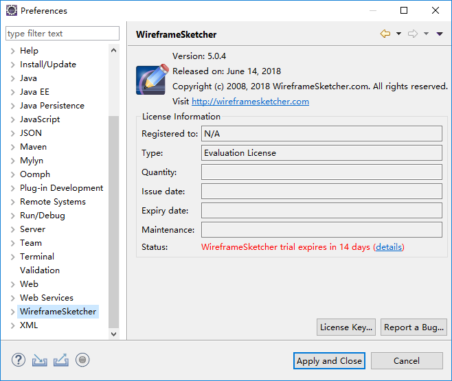
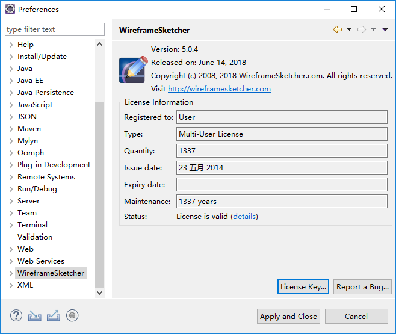

## 概述

Win10 + [eclipse-jee-photon-R-win32-x86_64.zip](https://mirrors.tuna.tsinghua.edu.cn/eclipse/technology/epp/downloads/release/photon/R/eclipse-jee-photon-R-win32-x86_64.zip) 实测通过。  
本文链接：<https://github.com/rj-hwang/ui-prototype-tools/tree/master/wireframesketcher/5.0.4>。  
下载地址：<https://pan.baidu.com/s/13kHjuUhOP65KThqxVgP2Xw>  
WireframeSketcher 官方网站：<http://wireframesketcher.com>

## 安装步骤（含破解）

1. 解压到 eclipse 安装目录下的 dropins 子目录下。
    目录结构如下：  
    ```
    dropins
      |--wireframesketcher-5.0.4
           |--features
           |--plugins
    ```
2. 启动 Eclipse，然后点击菜单 Windows/Preferences>WireframeSketcher。  
    将会看到默认 15 天的试用期，如下图所示：  
      
    注：首次启动并点击了上面的菜单后，将会自动在安装目录下生成文件 `configuration\.settings\com.wireframesketcher.ui.prefs`，内容如下：
    ```
    eclipse.preferences.version=1
    location=367203
    timestamp=1533029122843
    
    ```
    timestamp 的值是用来控制试用时间的，默认为 15 天的试用期（相对于 1970-01-01 之间的毫秒数）。
    直接把它改成 2023-01-01 对应的值 61633324800000，插件的 Status 就显示 Trial license，但不会提示几天后到期，相当于长期试用了，不过导出图片依然有水印。
3. 点击右下角的 "License Key..." 按钮执行注册。  
    填入 LicenseKey.txt 文件的内容，然后点击 "Register" 按钮返回后就可以看到注册成功的信息，如下图所示：  
      
    此时文件 `configuration\.settings\com.wireframesketcher.ui.prefs` 内容如下：
    ```
    eclipse.preferences.version=1
    licenseKey=---- BEGIN WIREFRAMESKETCHER KEY ---\r\nH4sIAAAAAAAAACXH3QqCMBgA0Ps9RS8Q/szq\r\nahehGIn2h5ZGIKs+dWHTtm+YPX1E5+6UpRa1\r\n5GgUlCVL/MEPfZoH/FOsx8Yq8LpGb9U/2kjH\r\n4fG0bPaum5+rYzevss2WprtVa9EoMgd428OF\r\nXRipFACTHRFaGwg4AnOpZc8s13Y88uRCIkgu\r\nb1AAV5o5lC7Iy3CJAsf/FNRCIyi4px3LNCiC\r\nYw8sMS2K6e+TWNxAavgCZQbsz7sAAAA\=\r\n----- END WIREFRAMESKETCHER KEY ----\r\n
    location=432091
    timestamp=1533029122843

    ```
    此时导出图片就没有水印了。
4. 首次接触 WireframeSketcher 的，可以打开其自带的教程例子快速上手。  
    自带教程例子打开方式：点击菜单 Help/Welcome>Tutorials>WireframeSketcher/Create a tutorial project。  
    更详细的语法请参考 [WireframeSketcher 官方帮助文档](http://wireframesketcher.com/help/help.html)。

## 其它

- [WireframeSketcher 官方帮助文档](http://wireframesketcher.com/help/help.html)
- [WireframeSketcher 官方网站](http://wireframesketcher.com)
- [Eclipse WireframeSketcher 插件安装地址](http://wireframesketcher.com/updates)： http://wireframesketcher.com/updates
