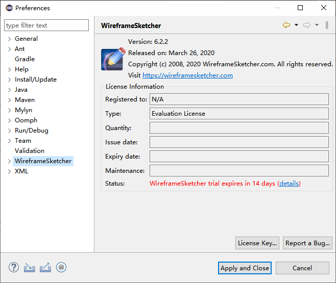
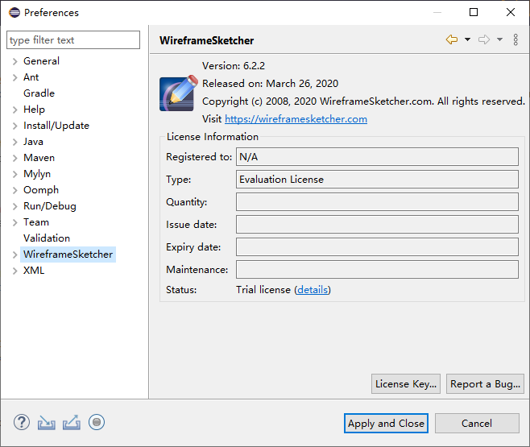
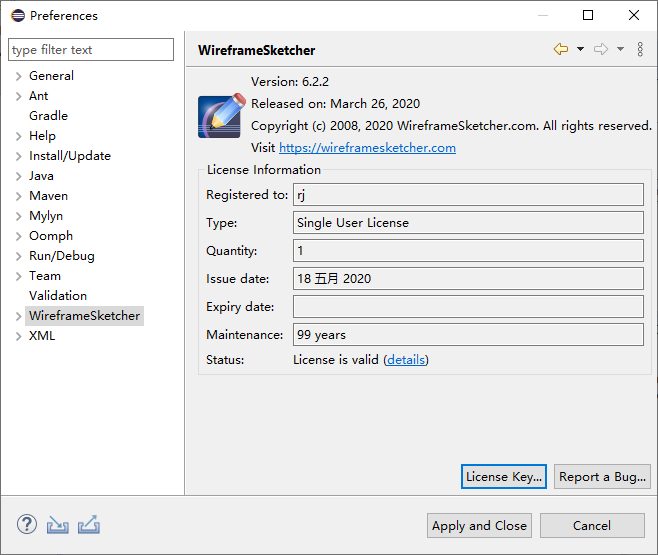

## 1. 概述

本文链接：<https://github.com/rj-hwang/ui-prototype-tools/tree/master/wireframesketcher/6.2.2>。  

Win10 + [eclipse-4.15.0-java-2020-03-R-win32-x86_64.zip](http://ftp.daumkakao.com/eclipse/technology/epp/downloads/release/2020-03/R/eclipse-java-2020-03-R-win32-x86_64.zip) 实测通过，理论上同时适用于 MacOS 和 Linux 版的 Eclipse。

  

## 2. 安装

### 2.1. 解压下载的 wireframesketcher-6.2.2.zip 文件

下载地址：<https://pan.baidu.com/s/1gL3BYhsOg4aGcNZiOyzoxg> （提取码 `5yab`）  

下载 `wireframesketcher-6.2.2.zip` 文件后解压到 eclipse 安装目录下的 dropins 子目录下，目录结构如下：  

```
dropins
  |--wireframesketcher-6.2.2
       |--features
       |--plugins
       |--...
```

> 这种方式是以插件的方式安装 WireframeSketcher。

### 2.2. 修改为无限试用期

启动 Eclipse，然后打开菜单 `"Windows > Preferences / WireframeSketcher"`，将会看到默认 15 天的试用期，如下图所示：



注：首次启动并打开了上面的菜单后，将会自动在安装目录下生成文件 `"configuration\.settings\com.wireframesketcher.ui.prefs"`，内容如下：

```
eclipse.preferences.version=1
location=9084
timestamp=1589785364142
```

其中 timestamp 的值是用来控制试用时间的，默认为 15 天的试用期（相对于 1970-01-01 之间的毫秒数）。直接把它改成 2023-01-01 对应的值 61633324800000，插件的 Status 就显示 `"Trial license"`，但不会提示几天后到期，相当于长期试用了，不过导出图片依然有水印。

  

## 3. 注册破解

### 3.1. 修改 eclipse.ini 文件，添加 javaagent 配置

修改 eclipse 安装目录下的 `eclipse.ini` 文件，在尾部添加如下一行：

```
-javaagent:${ECLIPSE_HOME}/WireframeSketcherAgent.jar
```

其中 `${ECLIPSE_HOME}` 为 eclipse 的安装目录，需要修改为实际的值，如：

```
-javaagent:D:\green\eclipse\dropins\wireframesketcher-6.2.2\WireframeSketcherAgent.jar
```

> WireframeSketcherAgent.jar 文件在上面下载的 zip 包内。

### 3.2. 生成 License Key

在 `WireframeSketcherAgent.jar` 文件所在目录下执行如下命令，按指引生成一个 License Key：

```shell
$ java -jar WireframeSketcherAgent.jar
Author: onisuly
Website: https://blog.onisuly.com

1. Usage
2. Generate License
2
Your name:
rj
1.Single User License
2.Multi-User License
1
---- BEGIN WIREFRAMESKETCHER KEY ---
H4sIAAAAAAAAAAXBuw6CMAAF0L1fwe5AMWpk
6KBFfIARVIK4kAauTYlWbEuUv/ecurZKauEG
g7pmR055nPPkE8ksaavxe1vd5XkVlDOUedCM
fb4v0kcf099h5zanSbalaz7JOiyGzzGijChr
B0TCgQVLn879KZ1S8hJKO2ihG1QQxrIwJAZS
WQeD9vpmpiNu7MEuSssnvMLCeKlqoC3IHym6
GyehAAAA
----- END WIREFRAMESKETCHER KEY ----
```

> 生成的 License Key 已保存一份在文件 `LicenseKey.txt` 内，也可以直接复制此文件的内容。

### 3.3. 使用生成的 License Key 注册

关闭并重新打开 Eclipse，打开菜单 `"Windows > Preferences"`，在弹出的窗口中点击左侧导航菜单 `"WireframeSketcher"`，然后点击右下角的 `"License Key..."` 按钮，填入上面生成的注册码，然后点击 `"Register"` 按钮返回后就可以看到注册成功的信息，如下图所示：  



注册成功后会在文件 `configuration\.settings\com.wireframesketcher.ui.prefs` 内写入填写的注册码，内容如下：

```txt
eclipse.preferences.version=1
licenseKey=---- BEGIN WIREFRAMESKETCHER KEY ---\r\nH4sIAAAAAAAAAAXBTQuCMBgA4Pt+hXcPTqnI\r\nww42sw+VtBIzgjH0bUxq6TYp/33Pw5iRQnE7\r\naWCM5BTTpKTpGIsi7Zr5e4vu4hz59QLq0m/n\r\noTxU2XNI8O+4t9uTW+zwhrpFD6tpzGP8IEga\r\nM0HMLRB/7eGlF+AAozeXyoLiqoUGuDYkDJEG\r\nIY0FDd31Q3SP7DwAuUglXuBUBrSTyRaUgT8X\r\nTfKcoQAAAA\=\=\r\n----- END WIREFRAMESKETCHER KEY ----\r\n
location=9084
timestamp=61633324800000
```

此时导出图片就没有水印了。  

## 4. 官方教程入口

首次接触 WireframeSketcher 可以打开其自带的教程例子快速上手，自带教程例子打开方式为打开菜单 `"Help > Welcome"`，然后：

- Overview："WireframeSketcher tutorial" 或 "WireframeSketcher user guide"
- Tutorials："WireframeSketcher > Create a tutorial project"

## 5. 其它

- WireframeSketcher 官方帮助文档：<http://wireframesketcher.com/help/help.html>
- WireframeSketcher 官方网站：<http://wireframesketcher.com>
- Eclipse WireframeSketcher 插件安装地址：<http://wireframesketcher.com/updates>


[破解来源]: https://www.zhinin.com/wireframesketcher-mac.html
