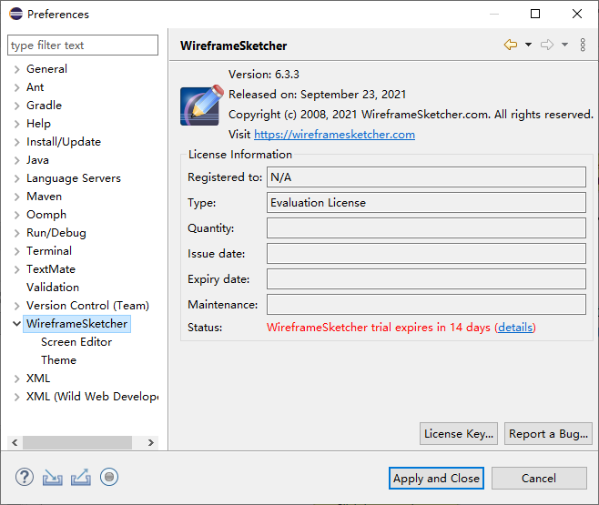

## 1. 概述

本文链接：<https://github.com/rj-hwang/ui-prototype-tools/tree/master/wireframesketcher/6.3.3>。  

Win10 + [eclipse-java-2021-09-R-win32-x86_64.zip](https://mirror.kakao.com/eclipse/technology/epp/downloads/release/2021-09/R/eclipse-java-2021-09-R-win32-x86_64.zip) 实测通过，理论上同时适用于 MacOS 和 Linux 版的 Eclipse。

  

## 2. 安装

### 2.1. 解压下载的 wireframesketcher-6.3.3.zip 文件

下载地址：<https://pan.baidu.com/s/13jr2mCPAnSPNbub6Unt0Zw> （提取码 `dtfu`）  

下载 `wireframesketcher-6.3.3.zip` 文件后解压到 eclipse 安装目录下的 dropins 子目录下，目录结构如下：  

```
dropins
  |--wireframesketcher-6.3.3
       |--features
       |--plugins
       |--...
```

> 这种方式是以插件的方式安装 WireframeSketcher。

### 2.2. 修改为无限试用期

启动 Eclipse，然后打开菜单 `"Windows > Preferences / WireframeSketcher"`，将会看到默认 15 天的试用期，如下图所示：



注：首次启动并打开了上面的菜单后，将会自动在安装目录下生成文件 `"configuration\.settings\com.wireframesketcher.ui.prefs"`，内容如下：

```
eclipse.preferences.version=1
location=9084
timestamp=1589785364142
```

其中 timestamp 的值是用来控制试用时间的，默认为 15 天的试用期（相对于 1970-01-01 之间的毫秒数）。直接把它改成 2023-01-01 对应的值 61633324800000，插件的 Status 就显示 `"Trial license"`，但不会提示几天后到期，相当于长期试用了，不过导出图片依然有水印。

  

## 3. 官方教程入口

首次接触 WireframeSketcher 可以打开其自带的教程例子快速上手，自带教程例子打开方式为打开菜单 `"Help > Welcome"`，然后：

- Overview："WireframeSketcher tutorial" 或 "WireframeSketcher user guide"
- Tutorials："WireframeSketcher > Create a tutorial project"

## 4. 其它

- WireframeSketcher 官方帮助文档：<http://wireframesketcher.com/help/help.html>
- WireframeSketcher 官方网站：<http://wireframesketcher.com>
- Eclipse WireframeSketcher 插件安装地址：<http://wireframesketcher.com/updates>
